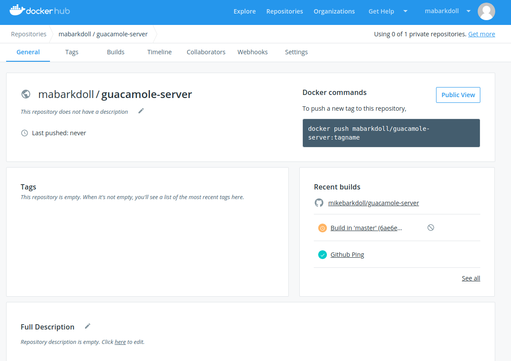

# How to build docker containers with GitHub and DockerHub

The following document requires an account at DockerHub and GitHub.  This document explains the following:

    1. How to fork the Apache Guacamole client and server repositories on GitHub.
    2. How to link your Github Account to your DockerHub account.
    3. How to automate the build of docker containers from your Github Apache Guacamole server and client repositories.

1. Create an account on DockerHub
http://hub.docker.com

2. Go to you Repositories

3. Click Account Settings

4. Under Account Settings, Go to Linked Accounts

Click the Connection Plug to link DockerHub to your currently logged in GitHub Account.

5. Click Authorize docker

6. On GitHub Fork the apache guacamole repositories.

https://github.com/apache/guacamole-server

https://github.com/apache/guacamole-client

7. On DockerHub, Create the repository

Click Create a Repository

Select Github under Build Settings

Select your organization and forked github repository

Select Click here to customize the build settings

Confirm similar settings.

You'll need to perform this step for both guacamole-client and guacamole-server.

8. Select Create & Build

Complete information of docker-hub build process:
https://docs.docker.com/docker-hub/builds/