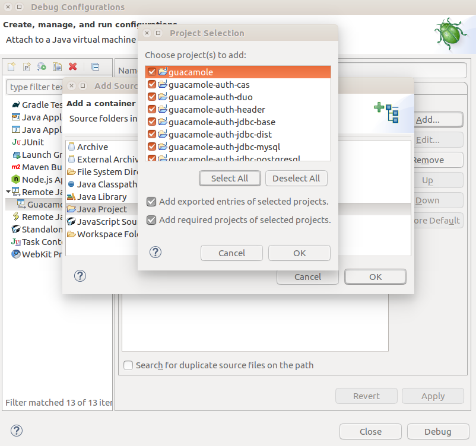

# Building Guacamole-client with remote debugging

Here we illustrate the steps necessary for building a custom guacamole-client docker container with maven with remote debugging enabled.  This will allow us to use eclipse to remotely set breakpoints in the code and diagnois issues in the code.

# Step 1: Download Apache Guacamole-Client
```shell
$ mkdir -p ~/FA19-GUAC/eclipse-build
$ cd ~/FA19-GUAC/eclipse-build
$ git clone https://github.com/apache/guacamole-client
```

# Step 2: Modify Guacamole-Client for remote debugging
Here we'll modify the Apache Guacamole-client tomcat servlet to support remote debugging.

## 2a. Add remote debugging to tomcat servlet

```shell
$ cd ~/FA19-GUAC/eclipse-build
$ vi guacamole-client/guacamole-docker/bin/start.sh
```

```
583 start_guacamole() {
584 
585     # Install webapp
586     rm -Rf /usr/local/tomcat/webapps/${WEBAPP_CONTEXT:-guacamole}
587     ln -sf /opt/guacamole/guacamole.war /usr/local/tomcat/webapps/${WEBAPP_CONTEXT:-guacamole}.war
588 
589     # Start tomcat
590     cd /usr/local/tomcat
591     exec catalina.sh run
592 
593 }
```

Change the exec line to:
```
     exec env JPDA_ADDRESS=0.0.0.0:8000 catalina.sh jpda run
```


This will allow set an env variable to allow any ip address to connect on port 8000 and enable jpda remote debugging.

```
start_guacamole() {

    # Install webapp
    rm -Rf /usr/local/tomcat/webapps/${WEBAPP_CONTEXT:-guacamole}
    ln -sf /opt/guacamole/guacamole.war /usr/local/tomcat/webapps/${WEBAPP_CONTEXT:-guacamole}.war

    # Start tomcat
    cd /usr/local/tomcat
    #exec catalina.sh run
    exec env JPDA_ADDRESS=0.0.0.0:8000 catalina.sh jpda run

}
```

## 2b. Modify the Dockerfile

Here will expose port 8000 on the remote machine to the docker containers port 8000.

```shell
$ cd ~/FA19-GUAC/eclipse-build/guacamole-client
$ vi Dockerfile
```
Under line 60:
```bash
59 # Start Guacamole under Tomcat, listening on 0.0.0.0:8080
60 EXPOSE 8080
```

Add: 

```bash
EXPOSE 8000
```

# Step 3: Build Guacamole-client docker container

```shell
$ cd ~/FA19-GUAC/eclipse-build/guacamole-client
$ sudo docker build -t mbarkdoll-fa19/guacamole-client .
```

# Step 4: Build Guacamole-client with maven

Make sure you machine has maven and a version of java jdk available.
```
$ apt-get install maven
$ apt-get install openjdk-8-jdk
```

See: https://openjdk.java.net/install/

```shell
$ cd ~/FA19-GUAC/eclipse-build/guacamole-client
$ mvn package
```

# Step 5: Launch the guacamole-client container

Note this requires that you've previously started a guacd and mysql instance.
```shell
$ sudo docker run --name some-guacamole --link some-guacd:guacd --link some-mysql:mysql -e MYSQL_DATABASE=guacamole_db -e MYSQL_USER=root -e MYSQL_PASSWORD=secret -e MYSQL_HOSTNAME=some_mysql -e MYSQL_PORT=3306 -v /home/cisadmin/guacamole/test:/home/admin/guacamole/test -p 8080:8080 -p 8000:8000 mbarkdoll-fa19/guacamole-client
```

# Opening src apache/guacamole-client inside eclipse

# Step 1: Download Eclipse

https://www.eclipse.org/downloads/

Select Download Packages


Recommending "Eclipse IDE for Java Developers" since it supports Java and Maven.


# Step 2: Extract Eclipse

```shell
$ cd ~/Downloads
$ tar -xzvf eclipse-java-2019-09-R-linux-gtk-x86_64.tar.gz
```

# Step 3: Launch Eclipse

```shell
$ cd ~/Downloads/eclipse
$ ./eclipse
```

# Step 4: Create a Workspace

We'll use:
/home/cisadmin/eclipse-guacamole-client


Click Launch

# Step 5: Import a maven project


Select File -> Import
or
Select Import projects...


Double click Maven


Select Existing Maven Projects
Click Next


Click Browse


Navigate to:
~/FA19-GUAC/eclipse-build/guacamole-client


Click Ok


Click Finish


This box kept coming up, I just cancelled out of this particular Markplace solution.


You'll likely notice that you have several errors!


Discover m2e connectors dialog box will display


Here we'll modify the action for Maven Build
angular-maven-plugin
and
apache-rat-plugin

Click Resolve Later under action and change it to Do Not Execute (add to pom)


Click Finish


Click Finish


Click Next


Click I accept the terms of the license agreements
Click Finish


This step will take some time...


Click Restart Now


I had one remaining error that required me to edit 
~/FA19-GUAC/eclipse-build/guacamole-client/guacamole/src/main/webapp/WEB-INF/web.xml
```
<?xml version="1.0" encoding="UTF-8"?>
<!--
    Licensed to the Apache Software Foundation (ASF) under one
    or more contributor license agreements.  See the NOTICE file
    distributed with this work for additional information
    regarding copyright ownership.  The ASF licenses this file
    to you under the Apache License, Version 2.0 (the
    "License"); you may not use this file except in compliance
    with the License.  You may obtain a copy of the License at

      http://www.apache.org/licenses/LICENSE-2.0

    Unless required by applicable law or agreed to in writing,
    software distributed under the License is distributed on an
    "AS IS" BASIS, WITHOUT WARRANTIES OR CONDITIONS OF ANY
    KIND, either express or implied.  See the License for the
    specific language governing permissions and limitations
    under the License.
-->
<!--  <web-app version="2.5"
         xmlns="http://java.sun.com/xml/ns/javaee"
         xmlns:xsi="http://www.w3.org/2001/XMLSchema-instance"
         xsi:schemaLocation="http://java.sun.com/xml/ns/javaee
                             http://java.sun.com/xml/ns/javaee/web-app_2_5.xsd">
-->

<web-app version="2.5" 
    xmlns="http://java.sun.com/xml/ns/j2ee" 
    xmlns:xsi="http://www.w3.org/2001/XMLSchema-instance" 
    xsi:schemaLocation="http://java.sun.com/xml/ns/j2ee http://java.sun.com/xml/ns/j2ee/web-app_2_5.xsd">
```

I'm not certain that this best practice... I need to read into it more.


Once the import completes you should no longer see errors.  

If you still see warnings try to Refresh the file view (key F5) or restart eclipse.


We'll now move on to remotely debugging the code.

# Remote Debugging

## Inside Eclipse

Open file:
~/FA19-GUAC/eclipse-build/guacamole-client/guacamole/src/main/java/org/apache/guacamole/GuacamoleSession.java

Set a breakpoint in your code (Shift+Ctrl+B)


Click Run -> Debug Configurations...


Double Click Remote Java Application


Click Soure Tab
Click Add


Select Java Project
Click Ok


Click Select All


Click OK


Click Apply


Click Debug

Open a web browser and open
http://localhost:8080/guacamole/

You might need to restart your guacamole-client container if you experience.  In this case you'll also have to reconnect your debugger in eclipse after restarting the docker container.


Login to guacamole-client's AngularJS application.


You'll be prompted to switch to a debugging perspective inside eclipse.

Click Switch


Click resume (F8) to allow the program to finish the login process.


Enjoy your debugging experience!!!